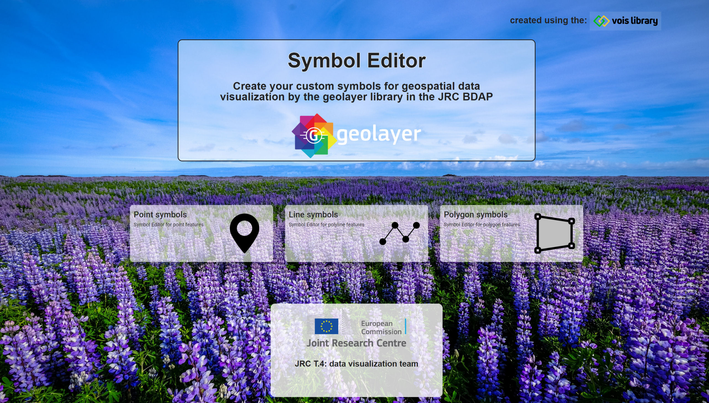
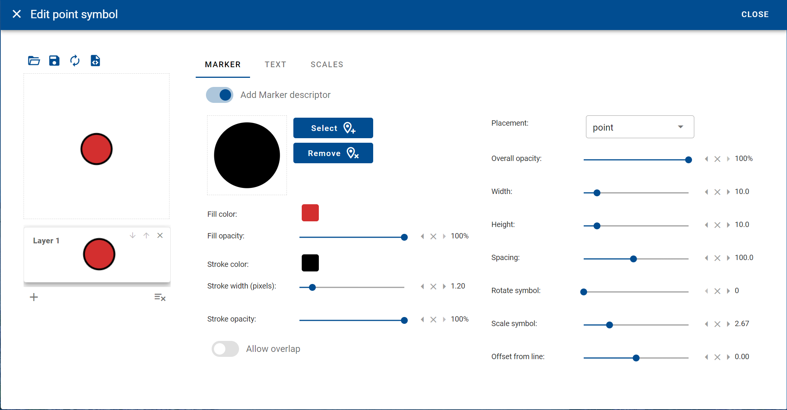
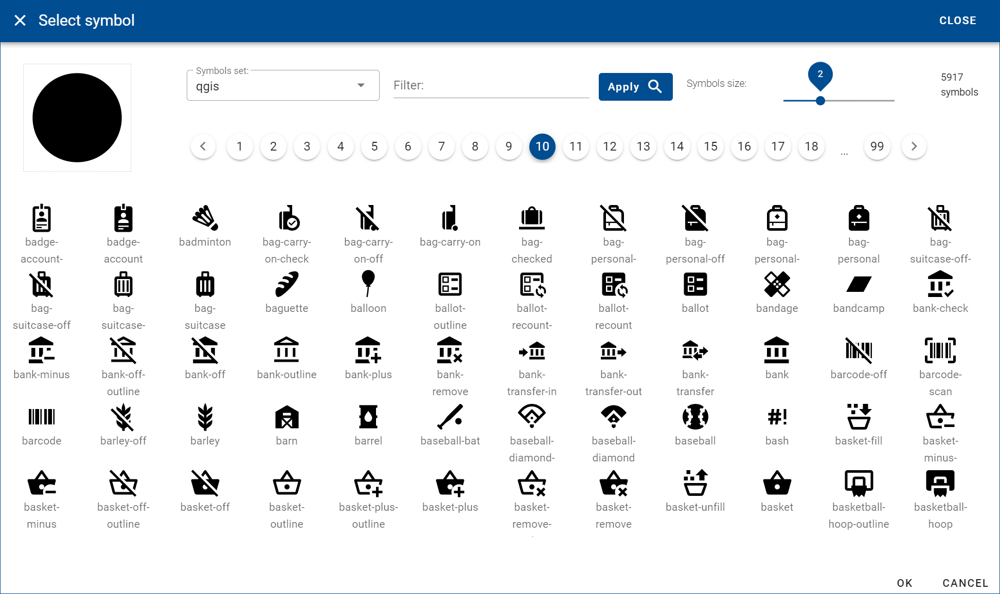
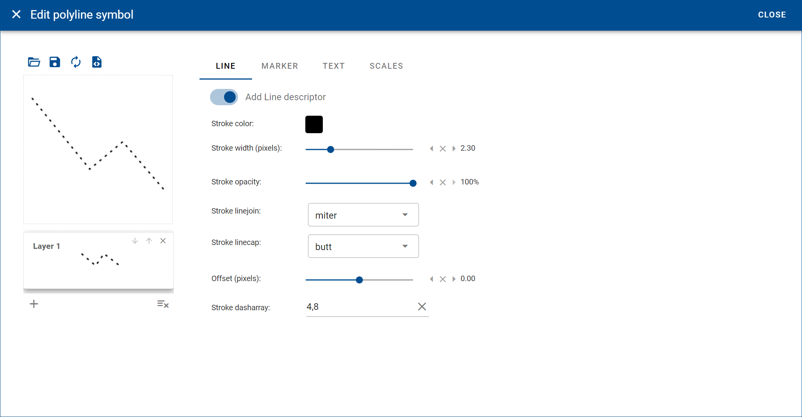
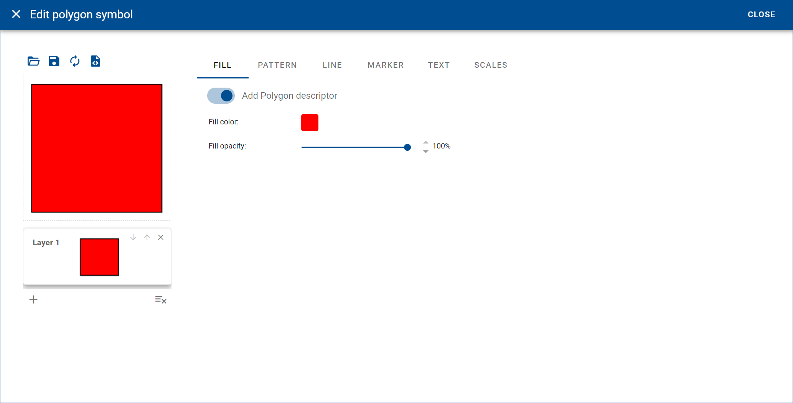
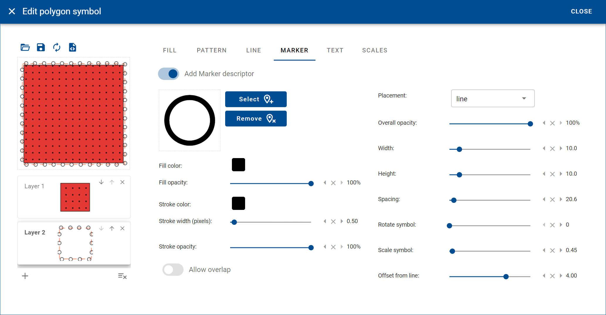
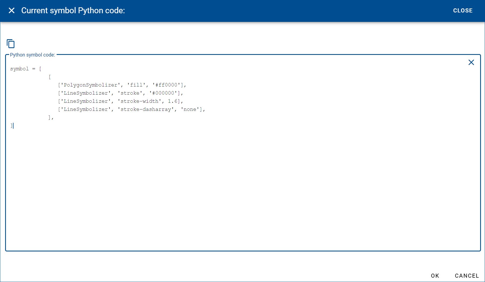

# GeoLayer

Python library for the visualization of vector and raster data server by the **tilegeo** dynamic tile server.

The online documentation for the geolayer library is available here: [geolayer Help](https://geolayer.readthedocs.io)

The source repository is available here: [geolayer Repo in GitHub](https://github.com/DavideDeMarchi/geolayer)

# SymbolEditor

To help users of the geolayer library to create symbols for their vector datasets display, an online tool was developed and deployed on the Microsoft Azure Cloud: [SymbolEditor in Azure](https://geolayer.azurewebsites.net/)

Here is a screenshot of the tool:

This web application can visually build symbols for points, polylines and polygons features. For each symbol, one or more layer(s) can be created, thus overlapping different descriptors to the visual representation of the features.

This is the interface for creating point symbols:

A vast selection of marker symbols can be browsed and searched to be inserted in the point symbol:

This is the interface for creating polyline symbols:

This is the interface for creating polygon symbols:

Multi-layer symbols can by easily created by overlapping custom fill patterns and complex multiple borders with repeating markers:

Symbols can be saved to the local computer in json format or uploaded from there.

After the visual creation of a symbol, by clicking on the right button on top of the symbol preview, it is possible to view the Python code that correspond to the created symbols and copy the lines to insert them directly into a JupyterLab notebook:

