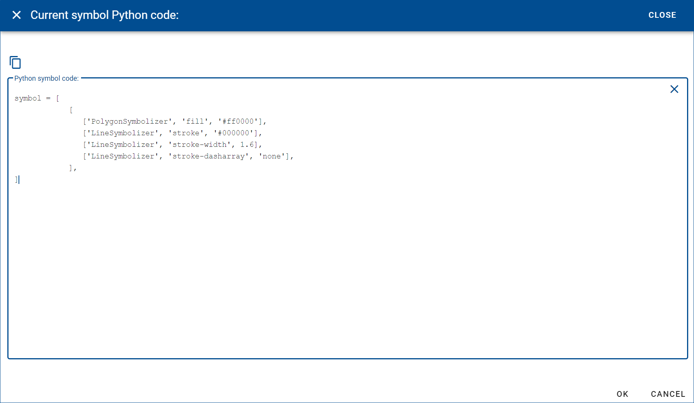

Usage
=====

.. _installation:

Installation
------------

geolayer cannot be installed autonomously. It is already pre-installed inside the JEO-lab docker images of the BDAP platform

Display raster datasets
-----------------------

Display vector datasets
-----------------------

.. note::

    **Vector symbology format**

    Inside BDAP, vector datasets are rendered using a dynamic tile server that converts vector features into raster tiles using the `Mapnik library <https://mapnik.org/>`_

    In geolayer, a symbol is a list of lists of items each having 3 elements: [SymbolizerName, KeyName, Value].

    Each list inside the symbol is mapped into a style (from style0 to style9), thus allowing for overlapped symbols

    Example: a symbol for polygon features that are rendered by filling the area in red color (#ff0000) with borders in black

    .. code-block:: console

        symbol = [
                    [
                       ["PolygonSymbolizer", "fill", '#ff0000'],
                       ["PolygonSymbolizer", "fill-opacity", 0.3],
                       ["LineSymbolizer", "stroke", "#010000"],
                       ["LineSymbolizer", "stroke-width", 2.0]
                    ]
        ]

    Example on how to manage symbology: create a vectorlayer instance to display a shapefile, then assign the symbology to all the feature or only to a subset of the features, filtered with a clause in its attributes:

    .. code-block:: console

       vlayer = vectorlayer.file('path to a .shp file', epsg=4326)
       vlayer.symbologyClear()

       # Apply symbol to all features of the vectorlayer
       vlayer.symbologyAdd(symbol=symbol)

       # Apply symbol only to features that are filtered by the rule on attributes
       vlayer.symbologyAdd(rule="[CNTR_CODE] = 'IT'", symbol=symbol)

       # If m is an instance of ipyleaflet.Map class, add the vector layer to the map
       m.add(vlayer.tileLayer())

    For a complete guide of the mapnik filter syntax, see the `Mapnik Filter syntax page <https://github.com/mapnik/mapnik/wiki/Filter>`_

    When creating legend of symbols, it can be useful to use "parametric" symbols. These are symbols where some of the visual attributes are written in a generic manner, by using some predefined keywords (like 'COLOR', 'FILL-COLOR', 'FILL-OPACITY', 'STROKE-COLOR', 'STROKE-WIDTH', etc.). The static method vectorlayer.symbolChange can be used to change a parametric symbol

    Example:

    .. code-block:: console

        # Parametric symbol using FILL-COLOR
        symbol = [
                    [
                       ["PolygonSymbolizer", "fill", 'FILL-COLOR'],
                       ["PolygonSymbolizer", "fill-opacity", 0.3],
                       ["LineSymbolizer", "stroke", "#010000"],
                       ["LineSymbolizer", "stroke-width", 2.0]
                    ]
        ]

        # Instantiate the symbol by substituting 'FILL-COLOR' with 'red'
        s = vectorlayer.symbolChange(fillColor='red')
        
        vlayer.symbologyAdd(s)

Create symbols for vector datasets
----------------------------------

To help users of the geolayer library to create symbols for their vector datasets display, an online tool was developed and deployed on the Microsoft Azure Cloud: `the Symbol Editor <https://geolayer.azurewebsites.net/>`_

Here is a screenshot of the tool:

.. image:: ./figures/SymbolEditor.png

This web application can visually build symbols for points, polylines and polygons features. For each symbol, one or more layer(s) can be created, thus overlapping different descriptors to the visual representation of the features.

This is the interface for inserting point symbols:

.. image:: figures/pointSymbol.png

A vast selection of marker symbols can be browsed and searched to be inserted in the point symbol:

.. image:: figures/markerSelect.png

This is the interface for inserting polyline symbols:

This is the interface for inserting polygon symbols:

Symbols can be saved to the local computer in json format or uploaded from there.

After the visual creation of a symbol, by clicking on the right button on top of the symbol preview, it is possible to view the Python code that correspond to the created symbols and copy the lines to insert them directly into a JupyterLab notebook:

